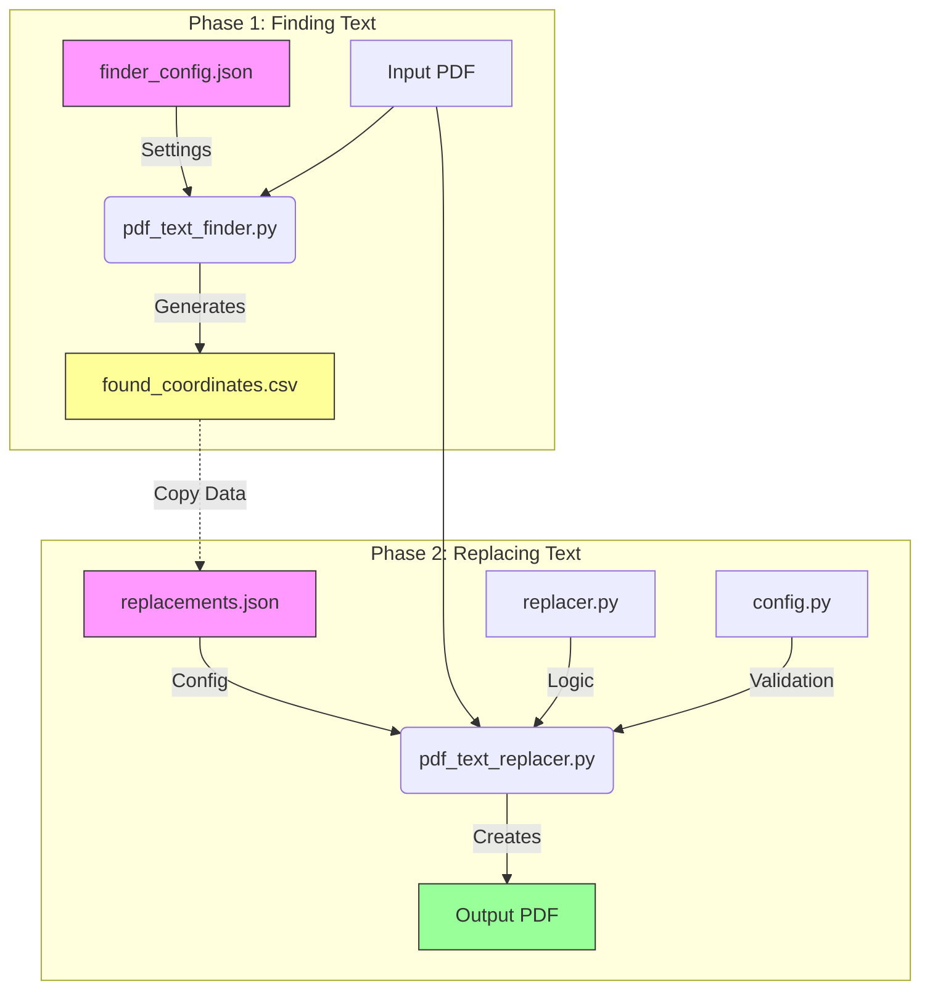

# PDF Text Replacement Tool - User Manual

This tool helps you replace text in engineering drawing PDFs with high precision. It is designed to look like a manual edit, using your custom fonts and preserving overlapping text (like lines or other text) that might be in the way.

---

## System Flowchart
This diagram shows how the files utilize each other.



## 1. Getting Started

### Step 1: Install Python
You need Python installed on your computer to run this tool.
1.  Go to [python.org/downloads](https://www.python.org/downloads/).
2.  Download the latest version (e.g., Python 3.10 or newer).
3.  **IMPORTANT:** During installation, check the box that says **"Add Python to PATH"**.

### Step 2: Organize Your Files
Make sure you have a folder containing these exact files. Do not delete them.

| File Name | Description |
| :--- | :--- |
| `pdf_text_replacer.py` | **The Main Tool**. Runs the actual replacement logic. |
| `pdf_text_finder.py` | **The Helper Tool**. Scans your PDF to find coordinates and fonts. |
| `replacer.py` | Core logic file (system file, do not touch). |
| `config.py` | Configuration file (system file, do not touch). |
| `finder_config.json` | Settings for the Helper Tool (Step 1). |
| `replacements.json` | Settings for the Main Tool (Step 2). |

### Step 3: Install Requirements
Open your Command Prompt (cmd) or Terminal in this folder and run this command once to install necessary libraries:

```bash
pip install pymupdf pikepdf pdfplumber Pillow pyyaml
```

---

## 2. Process Workflow

Follow these two steps for every new job.

### Phase 1: Finding Your Text (The Helper Tool)
Before replacing text, you need to know exactly *where* it is and *what font* it uses.

1.  **Edit `finder_config.json`**:
    Open this file in a text editor (Notepad is fine).
    ```json
    {
        "input_file": "EOT.pdf",  // Name of your PDF file
        "output_csv": "found_coordinates.csv",
        "searches": [
            { "text": "DATE:", "match_mode": "partial", "pages": "*" },
            { "text": "Title Code", "match_mode": "exact", "pages": "1" }
        ]
    }
    ```
2.  **Run the Helper**:
    ```bash
    python pdf_text_finder.py --config finder_config.json
    ```
3.  **Check Results**:
    Open the generated `found_coordinates.csv` file (in Excel or Notepad). You will see:
    *   **BBox**: The coordinates `[x0, y0, x1, y1]`. **Copy this.**
    *   **Font_Name**: The real font name (e.g., `Century Gothic Regular`). **Copy this.**

### Phase 2: Replacing Text (The Main Tool)
Now that you have the data, you can perform the replacement.

1.  **Edit `replacements.json`**:
    Update this file with the data from Phase 1.
    ```json
    {
        "input_file": "EOT.pdf",        // Your source file
        "output_file": "EOT_edited.pdf", // The new file to create
        "fonts": {
            "custom_font_paths": {
                // Define your fonts here. "Key": "Path to file"
                "MyRegular": "C:/Windows/Fonts/GOTHIC.ttf",
                "MyBold": "C:/Windows/Fonts/GOTHICB.ttf"
            },
            "default_font": "MyRegular"
        },
        "replacements": [
            {
                "id": "job_1",
                "pages": "1",
                "find_text": "DATE: 30/09/2024",       // Text to change
                "replace_text": "DATE: 12/12/2025",    // New text
                "coordinates": [650, 740, 830, 780],   // PASTE BBox HERE from CSV
                "match_mode": "exact",
                "font": "MyBold"                       // Key from "custom_font_paths"
            }
        ]
    }
    ```
2.  **Run the Replacer**:
    ```bash
    python pdf_text_replacer.py --config replacements.json --verbose
    ```
3.  **Verify**: Open `EOT_edited.pdf` and check the changes.

---

## 3. Configuration Reference

Guide to every setting in `replacements.json`.

### Global Settings
*   `input_file`: (String) Full path or filename of the PDF to edit.
*   `output_file`: (String) Name of the result PDF.
*   `fonts`:
    *   `custom_font_paths`: A list of fonts you want to use. You give each one a nickname (Key) and the path to the `.ttf` or `.otf` file.
    *   `default_font`: The nickname of the font to use if you don't specify one for a replacement.

### Replacement Settings
Properties inside the `replacements` list.

| Property | Description | Allowed Values |
| :--- | :--- | :--- |
| `id` | A unique name for this job. Helps you find it in the logs. | Any text (e.g., "title_fix", "date_update"). |
| `pages` | Which pages to search on. | `"1"` (Single page), `"1-5"` (Range), `"1,3,5"` (List), `"*"` (All pages). |
| `find_text` | The text you want to remove. | Any text string. Case-sensitive by default. |
| `replace_text`| The text you want to insert. | Any text string. |
| `coordinates`| The box defining where the text is. | List of 4 numbers: `[x0, y0, x1, y1]`. Use the Finder Tool to get these numbers. |
| `match_mode` | How strict the search is. | • `"exact"`: Must match the WHOLE text line perfectly.<br>• `"partial"`: Finds the text even if it's just part of a sentence. |
| `font` | **(Optional)** Which font to use for the **New Text**. | Must be one of the *Keys* you defined in `custom_font_paths` (e.g., "MyBold"). |
| `lift_font` | **(Optional)** Which font to use for **Background Text**. | Use this if the tool accidentally changes the look of overlapping text it restores. Must be a Key from `custom_font_paths`. |
| `tolerance` | **(Optional)** Fudge factor for coordinates. | Number (default `0.5`). Increase to `2.0` or `3.0` if the tool misses text that is slightly outside the box. |

---

## 4. Troubleshooting

**"Input file not found"**
*   Check if `input_file` name in JSON matches your actual PDF filename exactly.
*   Make sure the PDF is in the same folder as the script.

**"File is open" / Permission Error**
*   Close the PDF or the CSV file in Excel/Acrobat before running the tool. The tool cannot write to a file while you are viewing it.

**Text is found but font looks wrong**
*   Check your `replacements.json`. Did you set the `font` property?
*   Does the path in `custom_font_paths` point to the correct file (e.g., Regular vs Bold)?

**Overlapping text (lines/symbols) disappeared or looks thin**
*   The tool tries to "lift" overlapping items and put them back.
*   If the restored text looks wrong, add `"lift_font": "YourFontKey"` to that replacement entry to force it to use the correct font.
